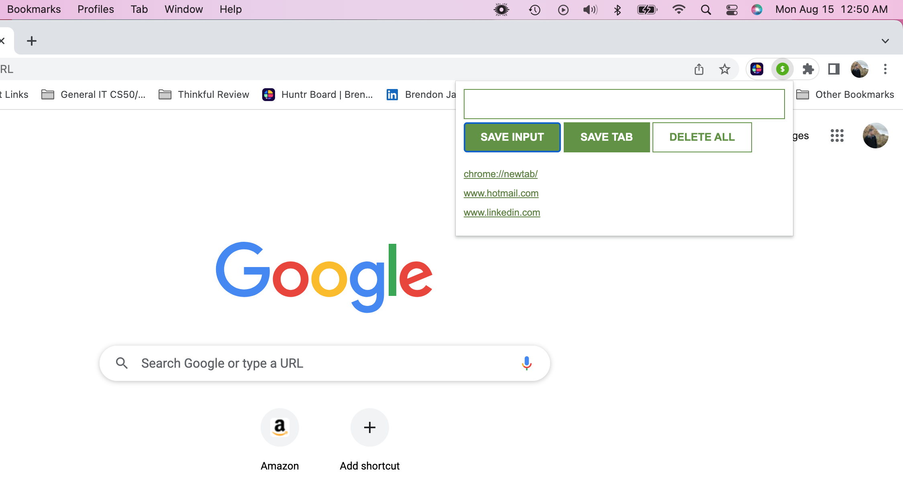

# Chrome Extension Project

#### In this project, I have created a Chrome Extension that can easily be added to any extensions folder in Crome.
This will give the user the ability to save any inputs the user wishes to type out for future reference, and another
option to simply click the SAVE TABS button we have been on. 

After the user is finished with this list they have created, they can delete all saves if needed, and start anew.
This will save the lists, even when there is a new window opened or pages refreshed.  HIGHLY useful product for 
real world uses

#### A full page view of the layout of this extension is provided below.  However, this will only have functionality 
of the SAVE INPUT and DELETE ALL buttons.  But in real world applications, it will be accessible via the extensions 
icon in Crome, and there be useable for all 3 buttons, including the SAVE TAB button, as illustrated above.

https://jacksondynamics.github.io/ChromeExtension/
